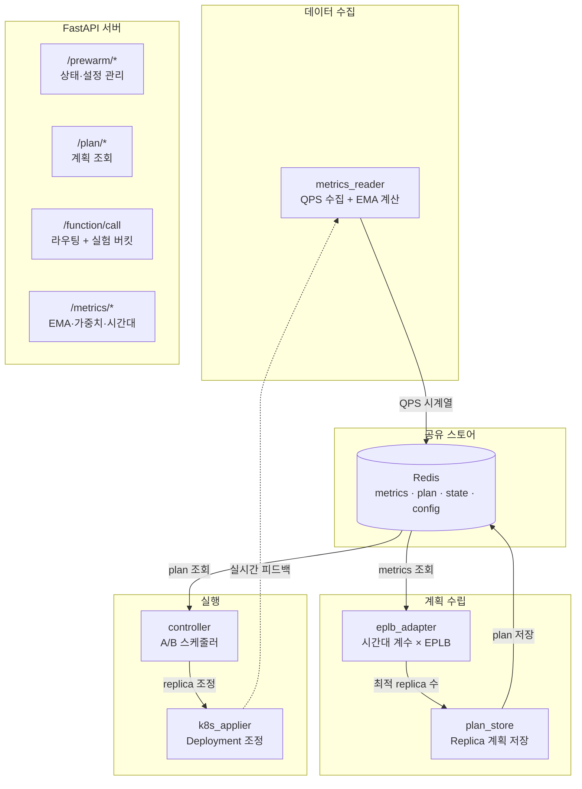
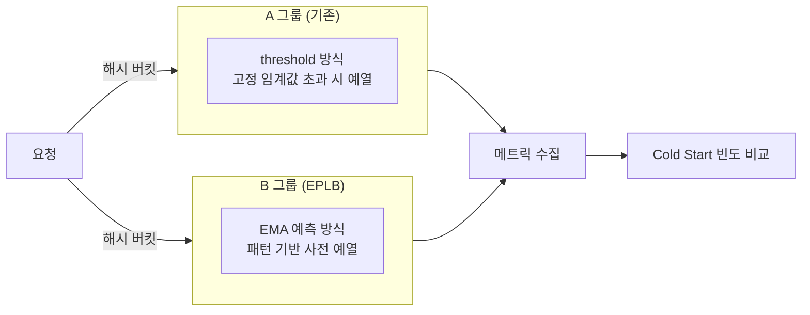
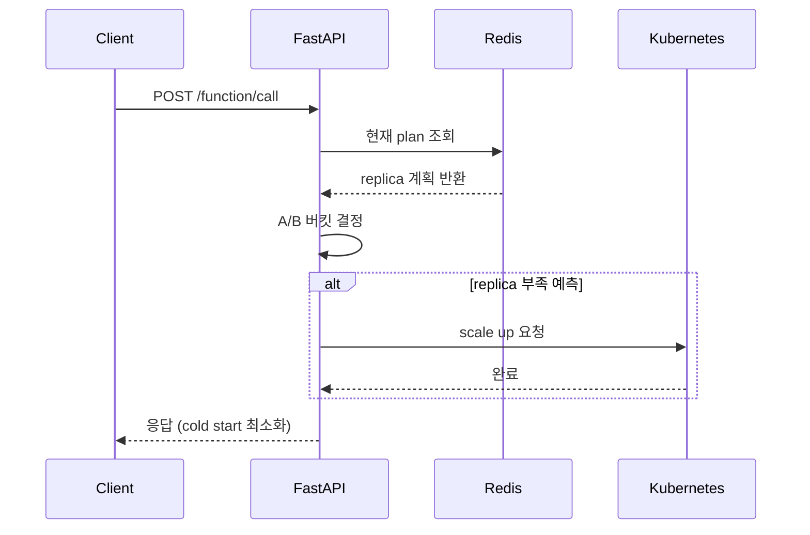

# AI Traffic Controller

> DeepSeek EPLB + EMA 기반 서버리스 Prewarm 시스템 — 소프트뱅크 해커톤 2025

## 배경

서버리스 함수는 일정 시간 호출이 없으면 컨테이너가 종료된다.
다음 요청이 들어올 때 컨테이너를 다시 시작하는 시간이 **Cold Start** 지연이다.

단순한 사전 예열(keep-warm) 방식은 트래픽 패턴을 모르기 때문에 두 가지 문제가 있다.

- 트래픽이 없는 시간에도 레플리카를 유지 → **리소스 낭비**
- 트래픽 급증 구간에는 예열이 늦어 **SLA 위반**

이 시스템은 **QPS 기반 EMA 예측 + DeepSeek EPLB 알고리즘**을 결합해
최적 레플리카 수를 사전에 배분함으로써 두 문제를 동시에 해결한다.

---

## 전체 아키텍처



---

## 핵심 모듈

### 1. QPS 수집 + EMA 계산 (`metrics_reader.py`)

단순 최근값 대신 **지수이동평균(EMA)** 으로 트래픽 노이즈를 제거한다.
`alpha` 값으로 얼마나 최근 데이터에 가중치를 줄지 조절할 수 있다.

```python
def compute_ema(qps_series: list[float], alpha: float = 0.3) -> float:
    ema = qps_series[0]
    for q in qps_series[1:]:
        ema = alpha * q + (1 - alpha) * ema
    return ema
```

여기에 **시간대별 가중치 테이블** (0.6 ~ 1.5)을 곱해
새벽에는 레플리카를 줄이고, 피크 타임에는 선제 증가시킨다.

### 2. EPLB 연동 (`eplb_adapter.py`)

DeepSeek의 `rebalance_experts` 알고리즘은 원래
MoE(Mixture of Experts) 모델의 전문가 노드 부하 분산을 위한 것이다.
이를 서버리스 레플리카 배분 문제에 **매핑**해서 적용했다.

| MoE 개념 | 서버리스 Prewarm 매핑 |
|---|---|
| Expert 노드 | 서버리스 함수 레플리카 |
| 토큰 부하 | 예측 QPS |
| 부하 균형 | 최적 레플리카 수 |
| Rebalance | Prewarm 계획 수립 |

### 3. A/B 실험 구조 (`controller.py`)

`prewarm_mode` 설정으로 두 방식을 동시에 실행해 정량 비교한다.



---

## 요청 처리 흐름



---

## 결과

| 항목 | 내용 |
|---|---|
| Cold Start 대응 | EMA 기반 사전 예열로 급증 구간 선제 대응 |
| 리소스 효율 | 시간대 계수로 불필요한 레플리카 유지 제거 |
| 측정 가능성 | A/B 실험으로 알고리즘 효과 정량 비교 |
| 확장성 | 시간대 계수 테이블만 수정해 재배포 없이 튜닝 |

---

## 배운 점

분산 시스템의 Cold Start 문제는 **모델 정확도**보다
**예측 주기와 실행 레이턴시의 트레이드오프**가 더 중요하다.

Redis를 plan 공유 스토어로 두면 controller ↔ applier 결합도를 낮출 수 있다.
각 컴포넌트가 Redis만 바라보기 때문에 스케일 아웃이 자유롭다.
