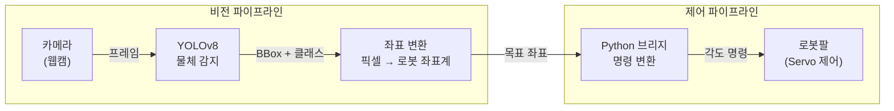
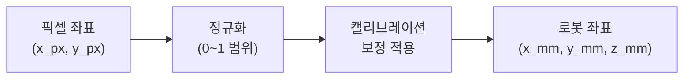
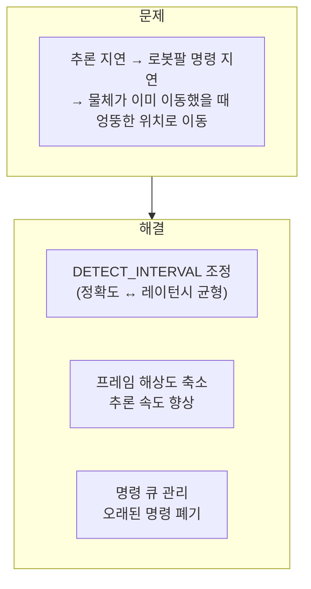

# 로봇팔 Object Detection

> YOLO 기반 실시간 물체 인식 + 로봇팔 제어 시스템 — AIoT 창의적 공학 설계 2025

## 배경

AIoT 창의적 공학 설계에서 소프트웨어와 하드웨어를 융합한 프로젝트를 진행했다.
카메라로 물체를 인식하고, 그 위치 정보를 실시간으로 로봇팔에 전달해서
**물체를 집는 동작을 자동화**하는 것이 목표였다.

소프트웨어 알고리즘이 물리 세계와 만나는 지점에서
**레이턴시와 정확도의 트레이드오프**를 직접 체감했다.

---

## 시스템 구조



---

## 핵심 구현

### 1. 실시간 YOLO 추론

매 프레임마다 YOLO를 실행하면 레이턴시가 너무 높았다.
**N프레임마다 추론** + 중간 프레임은 이전 결과 재사용하는 방식으로 균형을 맞췄다.

```python
frame_count = 0
last_detections = []

while True:
    frame = camera.read()
    frame_count += 1

    if frame_count % DETECT_INTERVAL == 0:
        last_detections = model.predict(frame)

    draw_boxes(frame, last_detections)
    send_to_arm(last_detections)
```

### 2. 픽셀 → 로봇 좌표 변환

카메라의 픽셀 좌표를 로봇팔이 이해하는 3D 좌표계로 변환해야 했다.
단순 선형 매핑으로 시작해, 카메라 왜곡과 로봇팔 도달 범위를 고려한
**캘리브레이션 보정값**을 반복 실험으로 도출했다.



### 3. 레이턴시 최적화



---

## 레이턴시 vs 정확도 트레이드오프

| 설정 | 추론 주기 | 레이턴시 | 정확도 |
|---|---|---|---|
| 매 프레임 | 1 | 높음 | 최고 |
| 3프레임마다 | 3 | 중간 | 좋음 ✅ |
| 5프레임마다 | 5 | 낮음 | 보통 |

3프레임마다 추론하는 설정이 실제 동작에서 가장 안정적이었다.

---

## 배운 점

소프트웨어 알고리즘이 아무리 정확해도,
**물리 세계의 제약** (레이턴시, 서보 응답 시간, 카메라 왜곡)과 결합하면
완전히 다른 문제가 된다.

"정확도 99%의 모델"보다 "100ms 안에 응답하는 70% 모델"이
실시간 제어 시스템에서는 더 유용할 수 있다.
