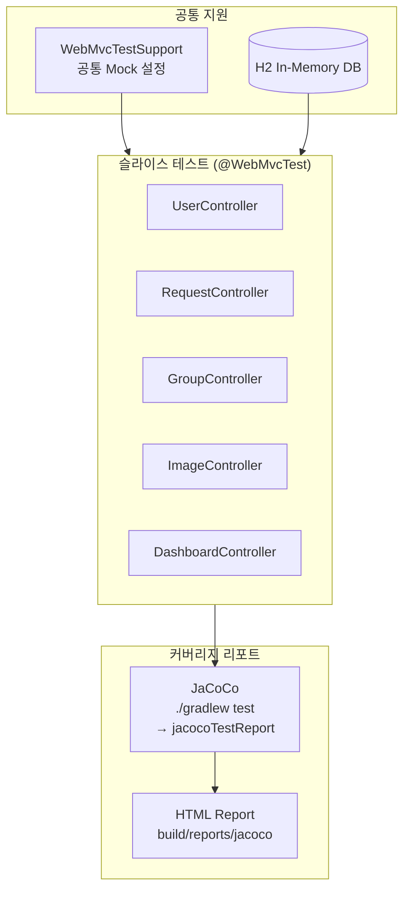
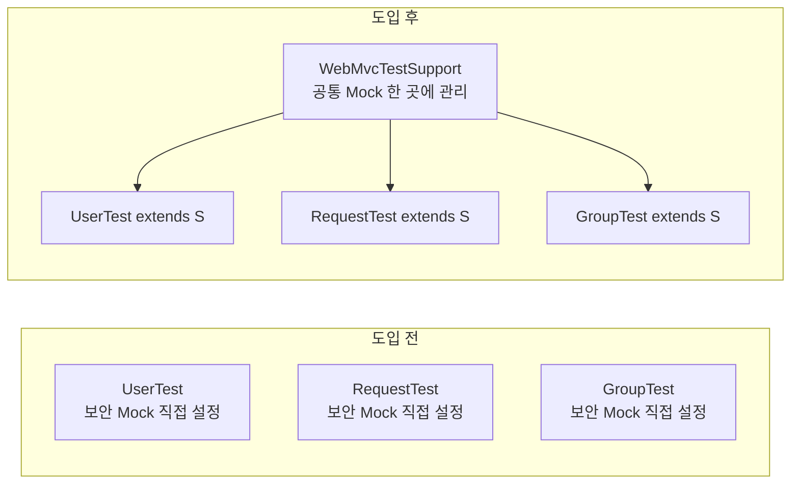
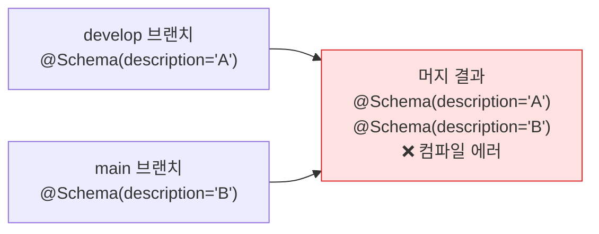

# CSID-DGU Admin Backend 테스트 인프라

> Spring Boot 기반 클러스터 관리 백엔드 전 도메인 테스트 스위트 구축 — iSN LAB 2026

## 배경

동국대 컴퓨터공학부 클러스터 관리 백엔드(`admin_be`)는
users, requests, groups, container images, dashboard 등 여러 도메인으로 구성된
Spring Boot 애플리케이션이다.

기능 구현은 되어 있었지만 **테스트 코드가 전혀 없었다.**
변경이 생길 때마다 수동으로 확인해야 했고, 회귀 버그가 언제 발생해도 감지할 수 없는 상태였다.

---

## 테스트 아키텍처



---

## `@WebMvcTest` 슬라이스 테스트

전체 Spring 컨텍스트를 로드하지 않고 **Controller 레이어만 격리**해서 테스트한다.
속도가 빠르고 의존성이 명확하다.

```java
@WebMvcTest(UserController.class)
class UserControllerTest extends WebMvcTestSupport {

    @MockBean
    private UserService userService;

    @Test
    void getUsers_returns200_whenUsersExist() throws Exception {
        given(userService.findAll()).willReturn(List.of(/* ... */));

        mockMvc.perform(get("/api/users"))
               .andExpect(status().isOk())
               .andExpect(jsonPath("$").isArray());
    }
}
```

### `WebMvcTestSupport` 도입 배경

`@WebMvcTest` 사용 시 공통 보안 설정(`SecurityConfig`)이 로드되지 않아
모든 테스트에서 컨텍스트 로드 실패가 반복됐다.

공통 Mock 설정을 한 곳에 모은 `WebMvcTestSupport`를 도입해 해결했다.



---

## JaCoCo 커버리지 파이프라인

```groovy
// build.gradle
jacocoTestReport {
    reports {
        html.required = true
        xml.required = true
    }
    dependsOn test
}

jacocoTestCoverageVerification {
    violationRules {
        rule {
            limit { minimum = 0.70 }  // 라인 커버리지 70% 기준
        }
    }
}
```

`./gradlew test` 실행 시 JaCoCo 리포트가 자동 생성되고,
커버리지 기준 미달 시 빌드가 실패하도록 설정했다.

---

## @Schema 중복 버그 수정

`develop → main` 브랜치 머지 시 컴파일 에러가 발생하는 잠재 버그를 발견했다.

**원인:** `@Schema` 어노테이션이 `@Repeatable`이 아닌데,
같은 위치에 어노테이션이 추가되는 머지 충돌이 발생해도
Git이 충돌로 감지하지 못해 중복이 쌓이는 구조였다.



9개 DTO, 총 15곳의 중복 `@Schema`를 발견하고 제거했다.

---

## 결과

| 항목 | 내용 |
|---|---|
| 테스트 커버리지 | 전 도메인 슬라이스 테스트 작성 완료 |
| CI 연동 | `./gradlew test` + `jacocoTestReport` 자동 실행 |
| 잠재 버그 | @Schema 중복 15곳 선제 제거 |
| 문서화 | `docs/TESTS.md` — 실행 방법·트러블슈팅 정리 |

---

## 배운 점

슬라이스 테스트는 빠른 피드백을 주지만,
**공통 보안 설정 누락**으로 컨텍스트 로드 실패가 잦다.
`WebMvcTestSupport` 같은 공통 베이스 클래스 도입이 표준 해법이다.

테스트를 작성하는 과정에서 `@Schema` 중복 버그처럼
**평소엔 보이지 않던 잠재 문제**를 자연스럽게 발견하게 된다.
