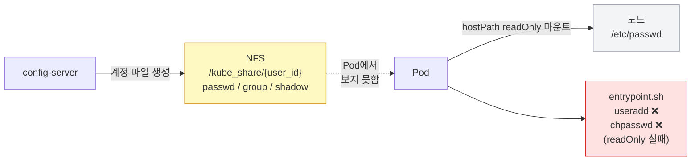
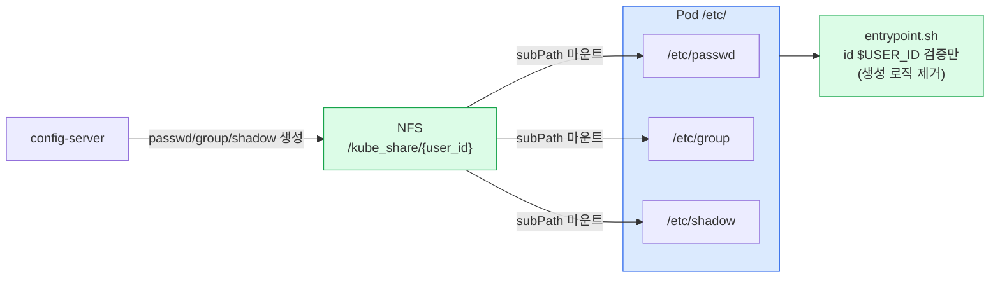
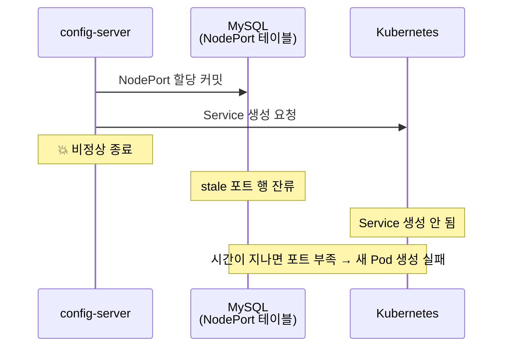

# CSID-DGU 클러스터 관리 인프라

> 동국대 컴퓨터공학부 서버 클러스터 Kubernetes 인프라 운영 — iSN LAB 2026

## 배경

동국대 컴퓨터공학부 연구실 서버 클러스터를 Kubernetes로 관리하는 시스템에서
두 가지 반복 장애가 발생하고 있었다.

1. **Pod 기동 실패** — 계정 파일 경로 불일치로 `entrypoint.sh`가 실패
2. **NodePort 누수** — config-server 비정상 종료 시 포트 할당 테이블이 정리되지 않아 포트 부족 발생

---

## 문제 1: Pod 계정 파일 마운트 구조

### 기존 구조 — 경로 불일치



`config-server`는 `/kube_share`에 계정 파일을 생성하는데,
Pod는 **노드의 `/etc/passwd`** 를 `hostPath`로 마운트하고 있었다.
결국 Pod는 계정 정보를 받지 못해 `entrypoint.sh`에서
`useradd`를 다시 시도하다 `readOnly` 환경에서 실패했다.

### 개선 구조 — subPath 마운트로 일원화



**핵심 변경:**
- `hostPath` 제거 → `/kube_share/{user_id}` 기반 **subPath 마운트**로 교체
- `entrypoint.sh`에서 `useradd`, `groupadd`, `chpasswd`, `sudoers` 수정 로직 전부 제거
- 컨테이너 시작 시 `id $USER_ID` 검증만 수행
- 계정 생성 책임을 **config-server로 완전 일원화**

---

## 문제 2: NodePort 누수

### 누수 발생 시나리오



### 해결 1: `release_nodeports` 즉시 롤백

`build_pod_spec`에서 NodePort 커밋 이후 단계에서 예외 발생 시
할당된 포트를 즉시 해제한다.

```python
try:
    allocate_nodeports(pod_name)    # DB 커밋
    create_k8s_service(pod_name)   # K8s 요청
except Exception:
    release_nodeports(pod_name)    # 즉시 롤백
    raise
```

### 해결 2: `reconcile_nodeport_allocations()`

K8s 실제 Service 목록과 MySQL 테이블을 **주기적으로 동기화**해서
stale 행을 자동으로 정리한다.

```python
def reconcile_nodeport_allocations():
    k8s_ports = get_active_k8s_nodeports()   # K8s 실제 Service 조회
    db_ports  = get_all_allocated_ports()    # MySQL 할당 테이블 조회
    stale     = db_ports - k8s_ports         # K8s에 없는 stale 포트
    release_nodeports_batch(stale)           # 일괄 정리
```

config-server 시작 시 `allocate_nodeports` 직전에 호출해
비정상 종료 이후에도 포트 상태를 안전하게 복구한다.

---

## 기타 개선

### 노드명 대소문자 정규화

Kubernetes 메타데이터 이름과 WAS 노드명이 대소문자로 불일치하는 경우가 있었다.
`resolve_k8s_node_name()` 함수로 조회 시 정식 이름을 보정했다.

### Helm Chart values 기반 전환

`nodeSelector`와 `tolerations`가 하드코딩되어 있어
다른 환경에 배포할 때마다 파일을 직접 수정해야 했다.

```yaml
# values.yaml
nodeSelector:
  kubernetes.io/hostname: csid-dgu-desktop
tolerations:
  - key: node-role.kubernetes.io/control-plane
    effect: NoSchedule
```

`values.yaml` 기반으로 전환해 환경별 배포 유연성을 확보했다.

---

## 결과

| 항목 | 이전 | 이후 |
|---|---|---|
| Pod 계정 기동 실패 | readOnly 환경에서 entrypoint 실패 | subPath 마운트로 완전 해소 |
| NodePort 누수 | 수동 DB 정리 필요 | reconcile 자동 복구 |
| 노드명 불일치 | 배포 실패 | resolve 함수로 자동 보정 |
| Helm 배포 | 파일 직접 수정 | values.yaml 기반 환경 분리 |
