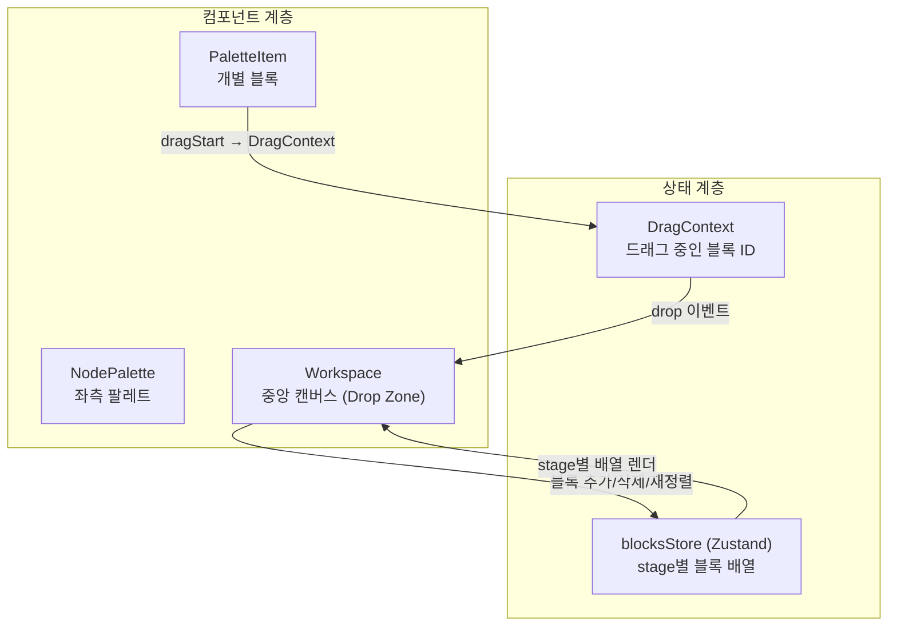
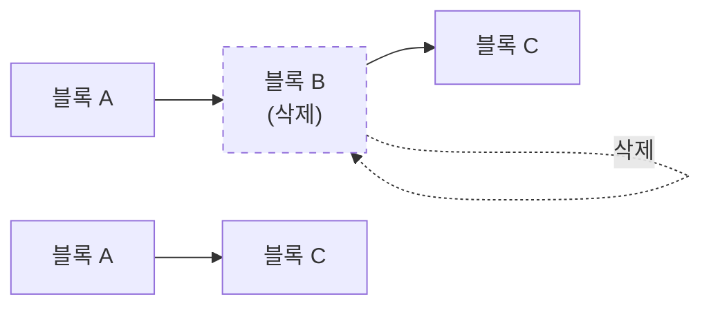
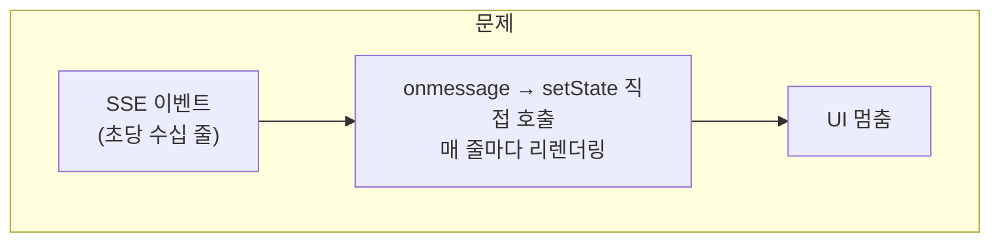
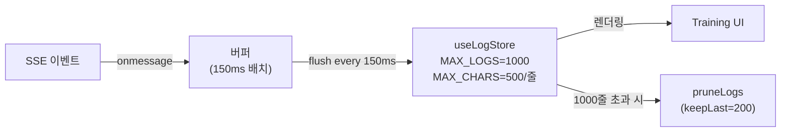
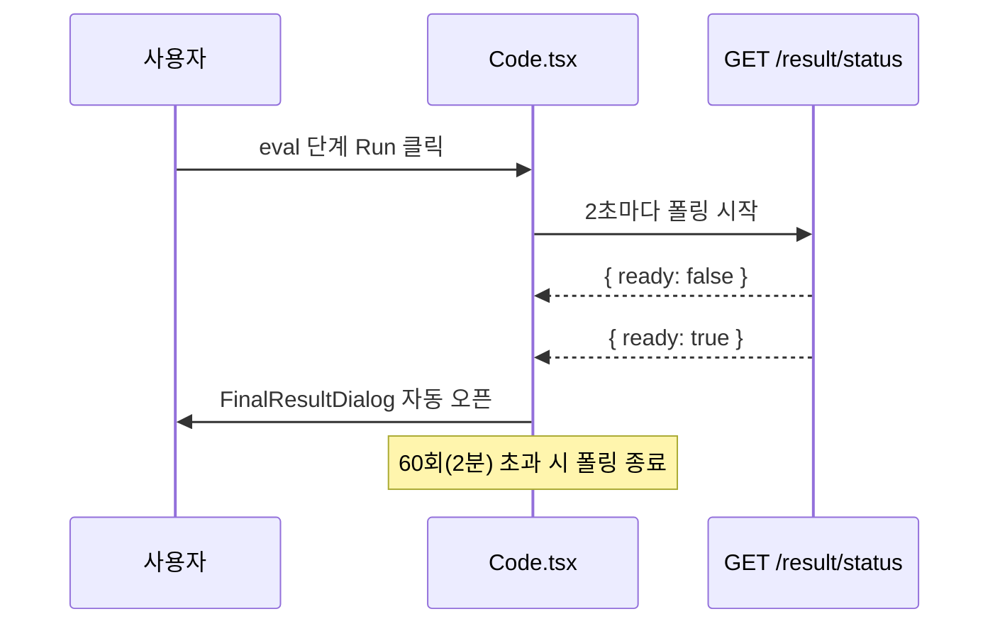

# CubeAI 블록 에디터

> 드래그앤드롭으로 AI 학습 파이프라인을 구성하는 블록 에디터 — 2025

## 배경

CubeAI는 블록을 끌어다 놓는 방식으로 AI 모델 학습 파이프라인을 구성하는 서비스다.
**Pre-processing → Model → Train → Eval** 각 단계를 블록으로 쌓고,
Run 버튼 하나로 실제 학습을 실행한다.

두 가지를 맡았다.
1. **드래그앤드롭 에디터 핵심 로직 구현**
2. **SSE 실시간 로그 렌더링 과부하 문제 해결**

---

## 문제 1 — 드래그앤드롭 에디터

### 상황

팔레트에서 블록을 드래그해 중앙 캔버스에 놓으면,
해당 블록이 현재 Stage의 파이프라인에 추가되어야 한다.
"중간 블록 삭제 시 앞뒤 블록이 재연결"되는 동작도 필요했다.

### 설계



`DragContext`는 드래그 중인 블록의 ID만 갖고,
실제 블록 배열 상태는 `blocksStore`(Zustand)가 stage별로 관리한다.
두 관심사를 분리해서 드래그 이벤트 변경이 블록 배열 로직에 영향을 주지 않도록 했다.

### 중간 블록 삭제



블록 B를 삭제할 때 B의 앞(A)과 뒤(C)를 직접 연결하는 재연결 로직을
`blocksStore`의 `removeBlock()` 안에서 처리했다.

---

## 문제 2 — SSE 로그 렌더링 과부하

### 상황

AI 학습 실행 중 서버가 SSE로 실시간 로그를 전송하는데,
초당 수십~수백 줄씩 들어오면서 **React 렌더링이 폭주해 UI가 멈추는 현상**이 발생했다.



### 해결: 3중 방어



**1. 배치 버퍼링**
```ts
// SSEComponent.tsx
let buffer: string[] = []
let flushTimer: ReturnType<typeof setTimeout> | null = null

eventSource.onmessage = (e) => {
  buffer.push(e.data)
  if (!flushTimer) {
    flushTimer = setTimeout(() => {
      addLogs(buffer)   // 150ms마다 한 번에 setState
      buffer = []
      flushTimer = null
    }, 150)
  }
}
```

**2. 로그 상한**
```ts
// useLogStore.ts
const MAX_LOGS = 1000
const MAX_LOG_CHARS = 500

addLogs: (newLogs) => {
  const trimmed = newLogs.map(l => l.slice(0, MAX_LOG_CHARS))
  set(state => ({ logs: [...state.logs, ...trimmed].slice(-MAX_LOGS) }))
}
```

**3. 스크롤 UX**
사용자가 위로 스크롤하면 자동 스크롤을 멈추고,
다시 하단에 도달하면 자동 스크롤을 재개했다.

```ts
// Training.tsx
const handleScroll = () => {
  const el = scrollRef.current
  const atBottom = el.scrollHeight - el.scrollTop <= el.clientHeight + 20
  setAutoScroll(atBottom)
}
```

### 결과

| 항목 | 개선 전 | 개선 후 |
|---|---|---|
| setState 빈도 | 줄마다 (초당 수십 회) | 150ms마다 1회 |
| 최대 로그 줄 수 | 무제한 | 1,000줄 |
| UI 멈춤 | 자주 발생 | 해소 |

---

## 평가 결과 자동 모달

eval 단계 실행 후 사용자가 직접 새로고침하거나 확인 버튼을 눌러야 결과를 볼 수 있었다.



---

## 배운 점

SSE처럼 고빈도 스트림을 `setState`에 직접 연결하면 렌더링이 폭주한다.
해결책은 단순하다 — **버퍼에 모아서 N ms마다 한 번에 flush.**

스로틀링 원리를 직접 구현하면서
브라우저 이벤트 루프와 React 렌더링 사이클의 관계를 체감했다.
"렌더링이 느리다"는 증상의 원인이 **데이터 양**이 아니라 **호출 빈도**에 있다는 것도.
