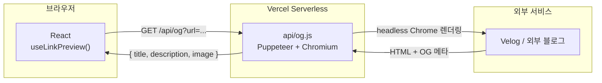
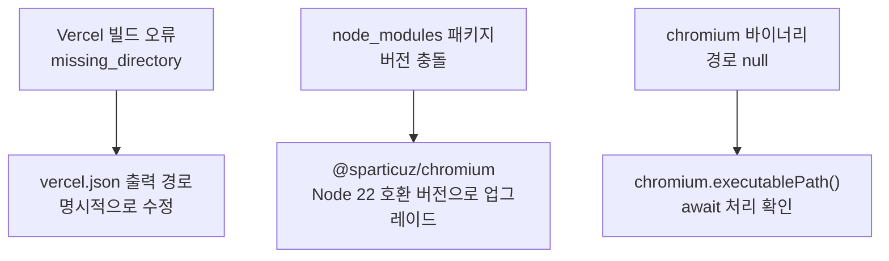
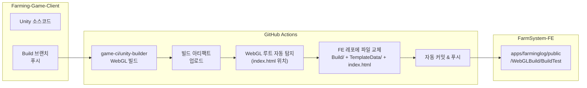

# FarmSystem 동아리 플랫폼

> 동국대 FarmSystem 동아리 홈페이지 + 파밍로그 앱 — 2025.03 ~ 2026.02

## 배경

DguFarmSystem은 동국대 소프트웨어 동아리다.
홈페이지(`apps/website`)와 활동 기록 앱(`apps/farminglog`)으로 구성된
**Turborepo + pnpm workspace** 모노레포를 팀이 함께 운영한다.

약 1년간 40개 이상의 PR을 기여했다.
기능 개발, 핫픽스, 인프라 설정, 배포 자동화까지 전 영역에 걸쳤다.

이 중 두 가지 문제 해결 경험이 특히 기억에 남는다.

---

## 문제 1 — CORS 막힌 외부 블로그 OG 태그

### 상황

홈페이지에 멤버들의 Velog 블로그를 링크 프리뷰로 표시하려 했다.
그런데 브라우저에서 `fetch(velogUrl)`을 하면 바로 CORS 오류가 발생했다.

```
Access to fetch at 'https://velog.io/@...' from origin 'https://farmsystem.kr'
has been blocked by CORS policy
```

Velog는 외부 서비스라 우리 쪽에서 CORS 허용 헤더를 추가할 수 없다.

### 해결: Vercel Serverless Function 직접 구현

브라우저가 직접 요청하는 대신, **서버리스 함수가 대리 요청**하는 구조로 전환했다.



단순히 `fetch(url)`로 HTML을 가져오는 것도 고려했지만,
Velog는 CSR이라 서버에서 fetch하면 `<title>`이 비어 있다.
**headless Chrome이 페이지를 실제로 렌더링한 후 OG 메타를 추출**하는 방식이 필요했다.

### 구현 (`api/og.js`)

```js
import chromium from '@sparticuz/chromium';
import puppeteer from 'puppeteer-core';

const isProd = !!process.env.VERCEL;

export default async function handler(req, res) {
  const { url } = req.query;

  // Vercel(Linux) vs 로컬(macOS) 환경 분기
  const executablePath = isProd
    ? await chromium.executablePath()
    : '/Applications/Google Chrome.app/Contents/MacOS/Google Chrome';

  const browser = await puppeteer.launch({
    executablePath,
    args: isProd ? chromium.args : [],
    headless: true,
  });

  const page = await browser.newPage();
  await page.goto(url, { waitUntil: 'networkidle0', timeout: 15_000 });

  const data = await page.evaluate(() => ({
    title:
      document.querySelector('meta[property="og:title"]')?.content ||
      document.title,
    description:
      document.querySelector('meta[property="og:description"]')?.content,
    image:
      document.querySelector('meta[property="og:image"]')?.content,
  }));

  res.setHeader('Access-Control-Allow-Origin', '*');
  res.status(200).json(data);
  await browser.close();
}
```

### 실제로 까다로웠던 것 — Node 22 환경 문제

Vercel이 Node 22로 업그레이드되면서 `@sparticuz/chromium` 패키지의
기존 버전이 호환되지 않았다.



PR을 7개 연속으로 날리면서 디버깅했다 (PR #296 ~ #303).
배포 환경과 로컬 환경의 차이를 직접 다루는 과정이었다.

---

## 문제 2 — Unity WebGL 수동 배포의 비효율

### 상황

Unity 게임 팀이 WebGL 빌드를 완성하면,
빌드 폴더 전체를 직접 FE 레포에 복사해서 커밋하는 과정이 필요했다.
파일이 크고 반복적이며 실수도 잦았다.

### 해결: GitHub Actions CI/CD 파이프라인 구축



**브랜치 분기 배포**도 설계했다.

| 소스 브랜치 | 배포 대상 |
|---|---|
| `Build` | `develop` (개발 서버) |
| `main` | `main` (프로덕션) |

또한 dev/prod 환경에서 API baseUrl이 달라지는 문제도 함께 해결했다.
Unity의 `APIManager.Awake()`에서 페이지 호스트를 기준으로 baseUrl을 자동 분기하도록 수정했다.

```csharp
void Awake() {
    string host = GetHostFromUrl(Application.absoluteURL);
    baseUrl = host.Contains("dev.") ? DEV_API_URL : PROD_API_URL;
    Debug.Log($"[API] Using baseUrl: {baseUrl}");
}
```

### 결과

Unity 게임 팀이 `Build` 브랜치에 push하면,
**5분 내에 개발 서버에 최신 게임이 자동 반영**된다.
수동 파일 복사 없이.

---

## 그 외 기여 (1년간)

| 작업 | 내용 |
|---|---|
| S3 게임 랜딩 퍼블리싱 | 여러 게임의 정적 랜딩 파일을 S3에 올리고 FE에서 동적으로 로드 |
| 파밍로그 페이지네이션 | 무한 스크롤 → 페이지 버튼 방식으로 전환 |
| 블로그 캐시 | react-query staleTime 설정으로 API 중복 호출 최소화 |
| 스켈레톤 UI | 블로그/프로젝트 로딩 시 레이아웃 안정화 |
| 핫픽스 대응 | OG 태그 null 처리, 서버 이전 후 proxy URL 업데이트 등 |

---

## 배운 점

CORS는 흔한 문제지만 **외부 서비스가 허용하지 않을 때**는 전략이 달라진다.
직접 제어할 수 없는 제약이 생기면, 구조를 바꿔서 돌아가는 게 맞다.

서버리스 함수의 런타임 환경(Node 버전, chromium 바이너리 경로)이
로컬과 다르다는 것을 배포 실패를 통해 직접 체감했다.
"내 PC에서 됩니다"는 배포 환경에서 보장이 안 된다.
