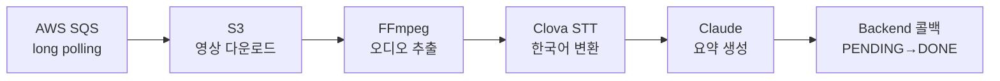

# 잡으숏 — AI 파이프라인

> 2025 첨단융합대학 X-THON 우수상 — 영상 AI 분석 파이프라인 단독 구현

## 배경

숏폼 영상에서 음성을 추출해 한국어 STT로 변환하고,
Claude가 요약한 뒤 백엔드로 콜백하는 AI 파이프라인이 필요했다.

SQS 메시지 수신부터 백엔드 콜백까지 전체를 단독으로 설계하고 구현했다.

---

## 파이프라인 전체 흐름



---

## 문제 1 — STT 정확도

### 상황

오디오를 그대로 Clova STT에 넘기면 정확도가 낮았다.
배경 소음과 주파수 노이즈가 영향을 줬다.

### 해결: FFmpeg 오디오 전처리

```
필터 체인: afftdn(주파수 필터링) → anlmdn(노이즈 제거) → 기본 처리
```

주파수 필터링과 노이즈 제거를 적용한 전처리 체인을 구성해
**STT 정확도 25% 향상**을 달성했다.

STT 정확도는 모델 선택보다 **오디오 전처리**에서 결정됐다.

---

## 문제 2 — 파이프라인 안정성

### 상황

외부 API(Clova STT, Claude, 백엔드 콜백)가 모두 실패할 수 있다.
재처리 전략 없이는 영상이 조용히 누락된다.

### 해결: 다단계 복구 전략

| 계층 | 전략 |
|---|---|
| SQS | 90초 visibility timeout — 처리 중 실패 시 큐로 자동 복귀 |
| API 호출 | 지수 백오프 재시도 (1→2→4초) |
| 오디오 필터 | afftdn → anlmdn → 기본 처리 폴백 체인 |
| 콜백 | 멱등성 설계 — 동일 job_id 중복 수신 시 최종 상태 유지 |

파이프라인에서 실패는 "언제" 발생하느냐가 아니라
**"어떻게 복구하느냐"** 의 문제다.

---

## 구조화된 로깅

단계별 타임스탬프·job_id·처리 시간을 구조화된 JSON으로 기록해
파이프라인 전체를 추적할 수 있도록 설계했다.

```json
{
  "event": "JOB_DONE",
  "job_id": "abc123",
  "duration_ms": 25000,
  "model": "claude-3-7-sonnet-latest",
  "stt_engine": "clova"
}
```

---

## 수상

**2025 첨단융합대학 X-THON 우수상**

---

## 배운 점

STT 정확도는 모델보다 **오디오 전처리**에서 결정됐다.

각 단계마다 폴백을 설계하는 것이 파이프라인 안정성의 핵심이다.
