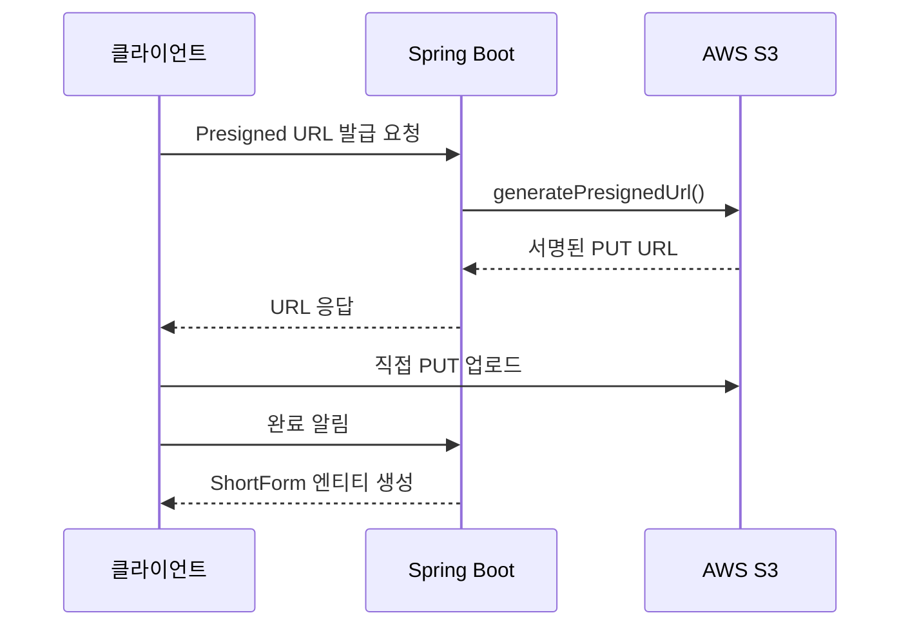
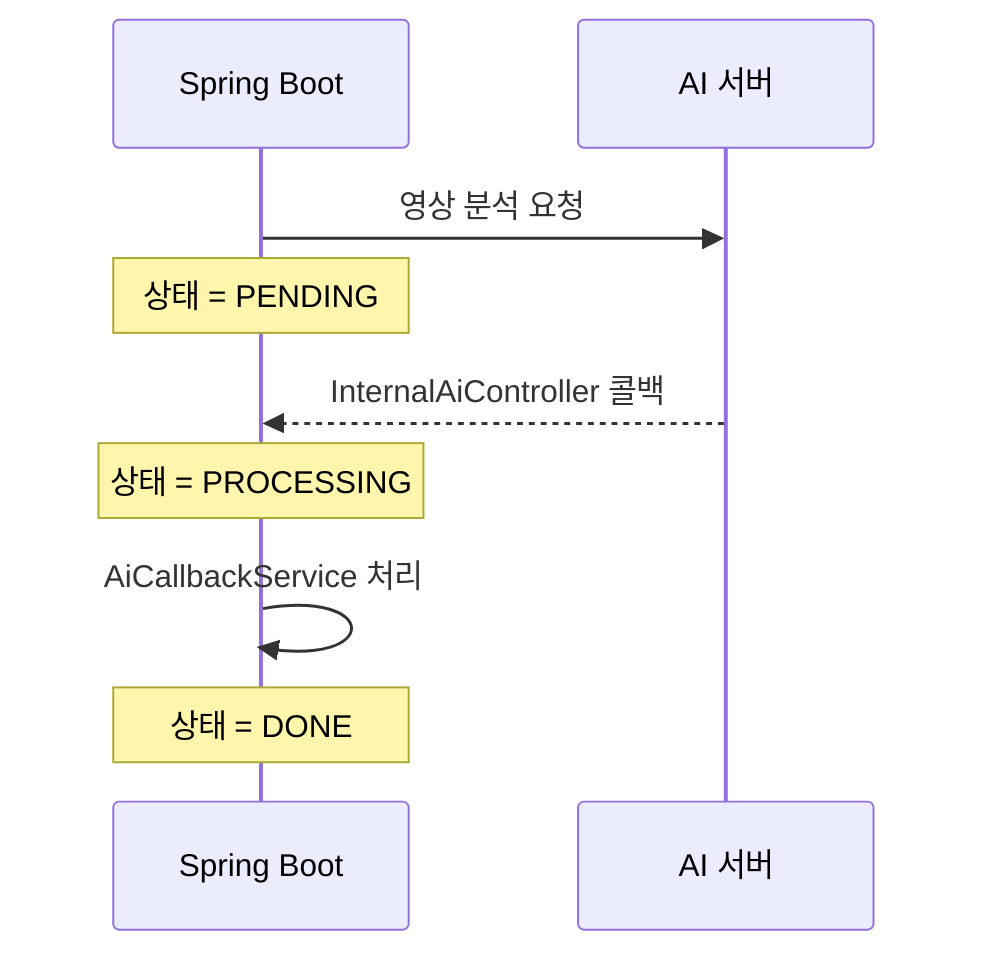
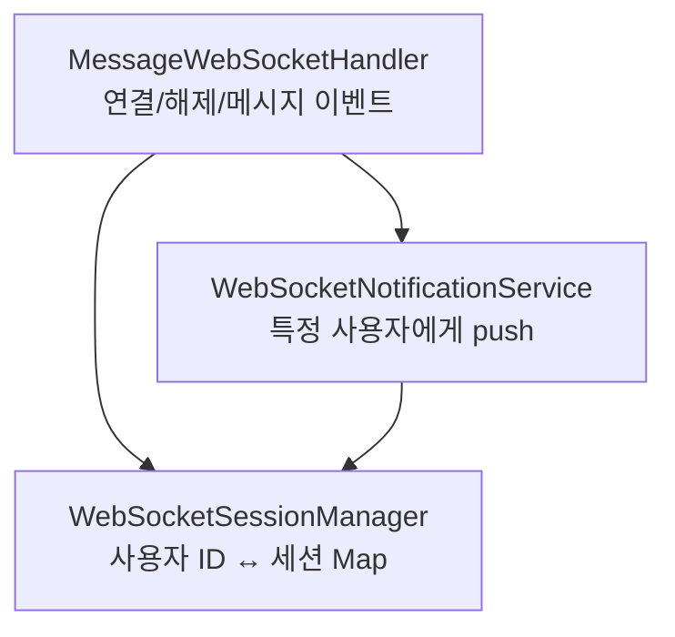

# 잡으숏 — 백엔드

> 2025 첨단융합대학 X-THON 우수상 — 숏폼 채용 플랫폼 Spring Boot 백엔드

## 배경

잡으숏은 구직자가 자기소개 숏폼 영상을 올리고,
기업이 영상을 보며 채용하는 **YouTube Shorts 형식의 채용 플랫폼**이다.

해커톤에서 Spring Boot 백엔드를 담당했다.
짧은 시간 안에 영상 업로드·AI 연동·실시간 메시지를 모두 동작하게 만들어야 했다.

---

## 문제 1 — S3 Presigned URL 업로드

### 상황

영상 파일을 서버를 통해 업로드하면 서버 트래픽이 폭증한다.
해커톤 서버 자원으로는 감당하기 어려웠다.

### 해결

`AwsS3Service`에서 PUT 서명 URL을 발급하고,
클라이언트가 서버를 거치지 않고 S3에 직접 업로드한다.
업로드 완료 알림 시 `ShortForm` 엔티티가 생성된다.

---

## 문제 2 — AI 비동기 콜백 수신

AI 처리 시간이 길어 HTTP 하나로 처리하면 타임아웃이 발생한다.

`InternalAiController`가 콜백을 받고,
`AiCallbackService`가 `PENDING → PROCESSING → DONE` 상태 전이를 관리한다.
동일 `job_id` 중복 수신 시에도 최종 상태를 유지하는 멱등성 설계.

---

## 문제 3 — WebSocket 메시지 시스템

구직자-기업 간 실시간 메시지를 3계층으로 분리 설계했다.

| 컴포넌트 | 역할 |
|---|---|
| `MessageWebSocketHandler` | 연결/해제/메시지 이벤트 처리 |
| `WebSocketSessionManager` | 사용자 ID ↔ WebSocket 세션 Map 관리 |
| `WebSocketNotificationService` | 특정 사용자에게 메시지 push |

---

## 수상

**2025 첨단융합대학 X-THON 우수상**

---

## 배운 점

비동기 콜백 패턴은 AI 처리 시간을 HTTP 타임아웃에서 완전히 분리해
해커톤 서버 안정성의 핵심이 됐다.

WebSocket 세션 관리는 짧은 시간에도 3계층으로 분리해두면
나중 디버깅이 압도적으로 쉬워진다.
