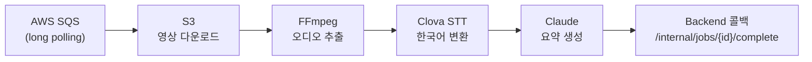
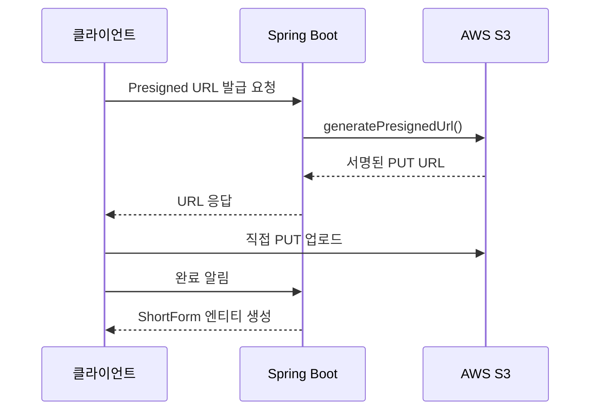
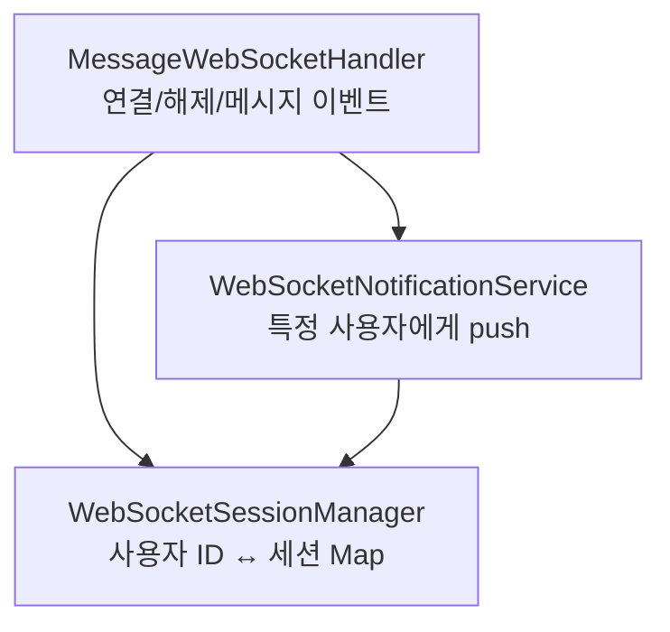

# 잡으숏 (JobShorts)

> 2025 첨단융합대학 X-THON 우수상 — 숏폼 영상 기반 채용 플랫폼

## 배경

잡으숏은 구직자가 자기소개 숏폼 영상을 올리고,
기업이 영상을 보며 채용하는 **YouTube Shorts 형식의 채용 플랫폼**이다.

Spring Boot 백엔드와 Python AI 파이프라인을 모두 담당했다.

---

## AI 파이프라인 — SQS → FFmpeg → Clova STT → Claude

### 전체 흐름



6단계 파이프라인 전체를 단독 구현했다.

### 핵심 문제 — STT 정확도

오디오를 그대로 넘기면 STT 정확도가 낮았다.
FFmpeg에 주파수 필터링(afftdn)과 노이즈 제거(anlmdn)를 적용한
오디오 전처리 체인을 구성해 **정확도 25% 향상**을 달성했다.

```
필터 폴백 체인: afftdn → anlmdn → 기본 처리
```

오디오 품질 개선이 모델 선택보다 STT 정확도에 더 크게 영향을 줬다.

### 안정성 설계

| 계층 | 전략 |
|---|---|
| SQS | 90초 visibility timeout — 실패 시 자동 재처리 |
| API | 지수 백오프 재시도 (1→2→4초) |
| 오디오 필터 | afftdn → anlmdn → 기본 처리 폴백 체인 |
| 콜백 | 멱등성 설계 — 동일 job_id 중복 처리 방지 |

---

## 백엔드 — S3 Presigned URL + AI 콜백 + WebSocket

### S3 Presigned URL 업로드



서버를 거치지 않는 직접 업로드로 해커톤 서버 부하 최소화.

### AI 비동기 콜백 수신

AI 처리 시간이 길어 HTTP 요청 하나로 처리하면 타임아웃이 발생한다.
`InternalAiController` + `AiCallbackService`로 비동기 콜백을 받아
`PENDING → PROCESSING → DONE` 상태 전이를 관리했다.

### WebSocket 메시지 시스템

구직자-기업 간 실시간 메시지를 3계층으로 분리 설계했다.



---

## 수상

**2025 첨단융합대학 X-THON 우수상**

---

## 배운 점

AI 파이프라인에서 STT 정확도는 모델보다 **오디오 전처리**에서 결정됐다.

비동기 콜백 패턴은 AI 처리 시간을 HTTP 타임아웃에서 완전히 분리해
해커톤 서버 안정성의 핵심이 됐다.
