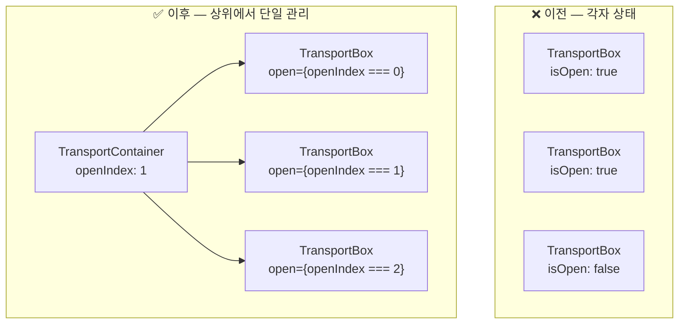
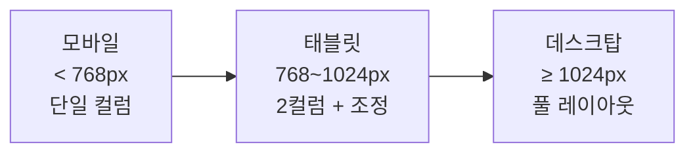

# YoungCamper 영캠프

> 동국대 청소년 캠프 행사 정보 사이트 — 장소안내 페이지 전담, 2024

## 배경

영캠프는 동국대에서 주최하는 청소년 대상 캠프 행사 사이트다.
여러 페이지 중 **장소안내(Location) 페이지 전체를 담당**했다.

교통편 정보를 아코디언 테이블로 보여주는 페이지인데,
모바일·태블릿·데스크탑 세 뷰포트를 모두 지원해야 하고,
한국어/영어 다국어 전환도 필요했다.

---

## 문제 1 — 아코디언 "하나만 열리기"

### 상황

아코디언 항목을 각각 독립적인 컴포넌트(`TransportBox`)로 만들었더니
각 컴포넌트가 자체 `isOpen` 상태를 갖고 있어서,
항목 A를 열고 항목 B를 눌러도 **A가 닫히지 않았다**.

### 원인과 해결



`openIndex`(현재 열린 항목 번호)를 `TransportContainer`에서 단일 관리하고,
각 `TransportBox`에 `open={openIndex === index}`로 내려주는 방식으로 변경했다.

---

## 문제 2 — 반응형 태블릿 뷰 깨짐

### 상황

모바일(`<768px`)과 데스크탑(`>=768px`)으로 분기했더니
**780~790px 구간에서 레이아웃이 어정쩡하게 깨지는 현상**이 발생했다.

### 해결



780~790px 경계에서 padding/width 값이 충돌하는 구간을 별도로 잡아서
미디어 쿼리를 3단계로 세분화했다.

---

## 문제 3 — 모바일 hover 잔상

터치 기기에서 아코디언 항목을 탭하면 **hover 스타일이 남아있는 문제**가 있었다.

```css
/* hover가 실제로 지원되는 기기에서만 적용 */
@media (hover: hover) {
  .transport-box:hover {
    background-color: ...;
  }
}
```

`@media (hover: none)`으로 터치 기기를 구분해 hover 스타일을 비활성화했다.

---

## 문제 4 — 아코디언 열릴 때 내용이 화면 밖으로

모바일에서 하단 아코디언을 열면 내용이 화면 아래로 밀려나는 문제가 있었다.

```js
// 아코디언 열릴 때 해당 항목으로 자동 스크롤
const handleOpen = (index) => {
  setOpenIndex(index)
  setTimeout(() => {
    refs[index].current?.scrollIntoView({ behavior: 'smooth', block: 'start' })
  }, 50) // 애니메이션이 시작된 후 스크롤
}
```

열린 직후 바로 scrollIntoView하면 아코디언이 펼쳐지기 전에 스크롤되므로,
50ms 딜레이를 둬서 **펼침 애니메이션이 시작된 후 스크롤**이 되도록 했다.

---

## i18n 다국어 전환

한국어/영어 전환 시 **레이아웃이 확대되는 버그**가 있었다.
영문 텍스트가 더 길어서 컨테이너 너비를 벗어나는 것이 원인이었다.

```json
// ko/translation.json
{ "location": "장소안내", "floor_1": "1층 안내도" }

// en/translation.json  
{ "location": "Location", "floor_1": "1st Floor Map" }
```

텍스트 길이에 무관하게 `overflow: hidden`과 고정 너비를 적용해 레이아웃을 고정했다.

---

## 배운 점

"독립적으로 보이는 컴포넌트"도 **서로 연동이 필요한 순간이 오면 상태를 끌어올려야 한다.**
이 타이밍을 처음부터 알아채는 게 나중에 리팩토링하는 것보다 훨씬 낫다.

반응형은 숫자(768px, 1024px) 문제가 아니라 **콘텐츠가 깨지는 실제 구간**을 찾는 문제다.
